# IntelliServOps Conceptual Diagram (Prisma)

## 1. Muc tieu

Tai lieu nay dung de ve conceptual diagram o muc business/data concept (tuong tu mau ERD ban gui), khong di qua chi tiet ky thuat.

Pham vi:

- Lay theo schema Prisma hien tai.
- Tap trung vao cac thuc the chinh va quan he cap cao.
- Khong liet ke day du tat ca thuoc tinh.

## 2. Cum thuc the (Domain Clusters)

### 2.1 Identity and Access

- User
- UserIdentity
- Staff
- Operator
- Admin
- RefreshToken
- PasswordResetToken
- OtpVerification
- PendingGuestRegistration

### 2.2 Property and Living Assets

- Apartment
- Room
- Amenity
- ApartmentAmenity
- UserApartment
- ApartmentRating

### 2.3 Contract and Customer Journey

- BookingRequest
- Reservation
- Appointment
- RentalContract
- UserContractMember

### 2.4 Operations

- MaintenanceRequest
- Task
- Notification
- ActivityLog
- FcmToken

### 2.5 Finance and Partner

- Invoice
- Payment
- PartnerCooperationContract
- CooperationCommissionPhase
- PartnerMonthlyPayout
- PartnerPayoutTransfer

### 2.6 IoT and Utility

- IoTBoard
- IoTDevice
- UtilityMeter
- UtilityReading

### 2.7 Policy and Governance

- Policy
- ApartmentPolicy

### 2.8 Chat

- ChatConversation
- ChatMessage

## 3. Quan he concept chinh

- User tham gia nhieu hop dong qua UserContractMember.
- RentalContract gan voi Apartment va sinh Invoice.
- Invoice co nhieu Payment.
- Apartment gom nhieu Room, co nhieu Amenity (qua ApartmentAmenity), va co nhieu UserApartment.
- Reservation co the tao RentalContract.
- BookingRequest do User tao va duoc Operator xu ly.
- Appointment duoc tao tu BookingRequest de Staff di xem can.
- MaintenanceRequest thuong duoc thuc hien boi Task.
- Notification/FcmToken la he thong giao tiep thong bao theo actor.
- Partner flow dua tren User: PartnerCooperationContract, PartnerMonthlyPayout, PartnerPayoutTransfer.
- IoTDevice va UtilityMeter gan vao Apartment/Room.
- Policy ap dung cho Apartment qua ApartmentPolicy.

## 4. Mermaid Final (Conceptual)

```mermaid
erDiagram
  %% =====================
  %% Identity and Access
  %% =====================
  USER {
    string id
    string email
    string fullName
  }
  USER_IDENTITY {
    string id
    string userId
  }
  STAFF {
    string id
    string email
  }
  OPERATOR {
    string id
    string email
  }
  ADMIN {
    string id
    string username
  }

  %% =====================
  %% Property and Assets
  %% =====================
  APARTMENT {
    string id
    string apartmentNumber
    string status
  }
  ROOM {
    string id
    string apartmentId
    string roomNumber
  }
  AMENITY {
    string id
    string code
    string name
  }
  APARTMENT_AMENITY {
    string apartmentId
    string amenityId
  }
  USER_APARTMENT {
    string id
    string userId
    string apartmentId
    string rentalContractId
  }
  APARTMENT_RATING {
    string id
    string apartmentId
    string userId
  }

  %% =====================
  %% Contract and Journey
  %% =====================
  BOOKING_REQUEST {
    string id
    string userId
    string apartmentId
    string handledByOperatorId
  }
  APPOINTMENT {
    string id
    string bookingRequestId
    string apartmentId
    string assignedStaffId
  }
  RESERVATION {
    string id
    string userId
    string apartmentId
  }
  RENTAL_CONTRACT {
    string id
    string apartmentId
    string contractNumber
    string status
  }
  USER_CONTRACT_MEMBER {
    string id
    string userId
    string rentalContractId
  }

  %% =====================
  %% Operations
  %% =====================
  MAINTENANCE_REQUEST {
    string id
    string userId
    string rentalContractId
    string apartmentId
  }
  TASK {
    string id
    string assignedToStaffId
    string assignedByOperatorId
    string apartmentId
  }
  NOTIFICATION {
    string id
    string recipientType
    string recipientId
  }
  ACTIVITY_LOG {
    string id
    string actorType
    string actorId
  }
  FCM_TOKEN {
    string id
    string actorType
    string actorId
  }

  %% =====================
  %% Finance and Partner
  %% =====================
  INVOICE {
    string id
    string rentalContractId
    string invoiceNumber
  }
  PAYMENT {
    string id
    string invoiceId
    string userId
  }
  PARTNER_COOPERATION_CONTRACT {
    string id
    string apartmentId
    string partnerId
  }
  COOPERATION_COMMISSION_PHASE {
    string id
    string phaseName
  }
  PARTNER_MONTHLY_PAYOUT {
    string id
    string partnerId
    string payoutMonth
  }
  PARTNER_PAYOUT_TRANSFER {
    string id
    string partnerId
    string periodMonth
  }

  %% =====================
  %% IoT and Utility
  %% =====================
  IOT_BOARD {
    string id
    string apartmentId
  }
  IOT_DEVICE {
    string id
    string apartmentId
    string roomId
  }
  UTILITY_METER {
    string id
    string apartmentId
  }
  UTILITY_READING {
    string id
    string utilityMeterId
    string rentalContractId
  }

  %% =====================
  %% Policy and Chat
  %% =====================
  POLICY {
    string id
    string title
  }
  APARTMENT_POLICY {
    string id
    string apartmentId
    string policyId
  }
  CHAT_CONVERSATION {
    string id
    string userId
  }
  CHAT_MESSAGE {
    string id
    string conversationId
  }

  %% Relationships
  USER ||--o| USER_IDENTITY : has

  APARTMENT ||--o{ ROOM : contains
  APARTMENT ||--o{ RENTAL_CONTRACT : contracted_by
  USER ||--o{ USER_CONTRACT_MEMBER : joins
  RENTAL_CONTRACT ||--o{ USER_CONTRACT_MEMBER : has_members

  RENTAL_CONTRACT ||--o{ INVOICE : bills
  INVOICE ||--o{ PAYMENT : paid_by
  USER ||--o{ PAYMENT : makes

  USER ||--o{ RESERVATION : creates
  APARTMENT ||--o{ RESERVATION : reserved

  USER ||--o{ MAINTENANCE_REQUEST : submits
  RENTAL_CONTRACT ||--o{ MAINTENANCE_REQUEST : under
  APARTMENT ||--o{ MAINTENANCE_REQUEST : at
  TASK o|--o| MAINTENANCE_REQUEST : handles
  STAFF ||--o{ TASK : executes
  OPERATOR ||--o{ TASK : assigns

  APARTMENT ||--o{ APARTMENT_AMENITY : has
  AMENITY ||--o{ APARTMENT_AMENITY : catalog

  USER ||--o{ USER_APARTMENT : accesses
  APARTMENT ||--o{ USER_APARTMENT : occupied_by
  RENTAL_CONTRACT ||--o{ USER_APARTMENT : bound_to

  USER ||--o{ APARTMENT_RATING : rates
  APARTMENT ||--o{ APARTMENT_RATING : receives

  APARTMENT ||--o{ IOT_DEVICE : equipped_with
  ROOM ||--o{ IOT_DEVICE : installed_in
  APARTMENT ||--o{ IOT_BOARD : has_board
  APARTMENT ||--o{ UTILITY_METER : has_meter
  UTILITY_METER ||--o{ UTILITY_READING : records
  RENTAL_CONTRACT ||--o{ UTILITY_READING : allocates

  APARTMENT ||--o{ APARTMENT_POLICY : governed_by
  POLICY ||--o{ APARTMENT_POLICY : applied_to

  USER ||--o{ PARTNER_COOPERATION_CONTRACT : partner_of
  APARTMENT ||--o{ PARTNER_COOPERATION_CONTRACT : cooperation_for
  USER ||--o{ PARTNER_MONTHLY_PAYOUT : receives
  STAFF ||--o{ PARTNER_MONTHLY_PAYOUT : confirms
  USER ||--o{ PARTNER_PAYOUT_TRANSFER : receives_transfer
  STAFF ||--o{ PARTNER_PAYOUT_TRANSFER : confirms_transfer

  USER ||--o{ CHAT_CONVERSATION : owns
  CHAT_CONVERSATION ||--o{ CHAT_MESSAGE : includes

  USER ||--o{ BOOKING_REQUEST : requests
  APARTMENT ||--o{ BOOKING_REQUEST : booked_for
  OPERATOR ||--o{ BOOKING_REQUEST : handles

  USER ||--o{ APPOINTMENT : books
  APARTMENT ||--o{ APPOINTMENT : viewed_at
  STAFF ||--o{ APPOINTMENT : attends
  BOOKING_REQUEST ||--o{ APPOINTMENT : originates
```



## 5. Cach su dung

- Day la conceptual view: uu tien hieu nghiep vu, khong can day du cot/constraint.
- Neu can physical/data-model detail, tach thanh tai lieu rieng (physical ERD).
- Ban co the bo bot entity theo slide context (Sales flow, Ops flow, Finance flow) de tranh roi.

## 6. DBDiagram Code (Logical ERD Mau)

```dbml
Project IntelliServOpsLogicalERD {
  database_type: "PostgreSQL"
  Note: "Logical ERD from approved conceptual flow"
}

Table user {
  id uuid [pk]
  email varchar
  full_name varchar
  phone varchar
  role varchar
  is_active boolean
  created_at timestamp
  updated_at timestamp
}

Table user_identity {
  id uuid [pk]
  user_id uuid [unique]
  provider varchar
  provider_uid varchar
  verified_at timestamp [null]
  created_at timestamp
}

Table staff {
  id uuid [pk]
  email varchar
  full_name varchar
  phone varchar [null]
  status varchar
  created_at timestamp
}

Table operator {
  id uuid [pk]
  email varchar
  full_name varchar
  phone varchar [null]
  status varchar
  created_at timestamp
}

Table apartment {
  id uuid [pk]
  apartment_number varchar
  apartment_name varchar
  building varchar [null]
  floor int [null]
  area_m2 decimal [null]
  monthly_rent decimal [null]
  status varchar
  created_at timestamp
  updated_at timestamp
}

Table room {
  id uuid [pk]
  apartment_id uuid
  room_number varchar
  room_name varchar [null]
  room_type varchar [null]
  area_m2 decimal [null]
  status varchar
}

Table amenity {
  id uuid [pk]
  code varchar
  name varchar
  category varchar [null]
  is_active boolean
}

Table apartment_amenity {
  apartment_id uuid [pk]
  amenity_id uuid [pk]
}

Table rental_contract {
  id uuid [pk]
  apartment_id uuid
  contract_number varchar
  start_date date
  end_date date [null]
  deposit_amount decimal [null]
  monthly_rent decimal [null]
  status varchar
  signed_at timestamp [null]
}

Table user_contract_member {
  id uuid [pk]
  user_id uuid
  rental_contract_id uuid
}

Table reservation {
  id uuid [pk]
  user_id uuid
  apartment_id uuid
  check_in_date date [null]
  check_out_date date [null]
  status varchar
  source varchar [null]
}

Table user_apartment {
  id uuid [pk]
  user_id uuid
  apartment_id uuid
  rental_contract_id uuid
  role varchar [null]
  start_date date [null]
  end_date date [null]
  status varchar
}

Table apartment_rating {
  id uuid [pk]
  user_id uuid
  apartment_id uuid
  score int
  comment text [null]
  created_at timestamp
}

Table maintenance_request {
  id uuid [pk]
  user_id uuid
  apartment_id uuid
  rental_contract_id uuid
  title varchar
  description text [null]
  priority varchar
  status varchar
  requested_at timestamp
  resolved_at timestamp [null]
}

Table task {
  id uuid [pk]
  maintenance_request_id uuid [null]
  assigned_to_staff_id uuid
  assigned_by_operator_id uuid
  apartment_id uuid
  title varchar
  status varchar
  due_at timestamp [null]
  completed_at timestamp [null]
}

Table invoice {
  id uuid [pk]
  rental_contract_id uuid
  invoice_number varchar
  billing_period varchar [null]
  total_amount decimal
  due_date date
  status varchar
  issued_at timestamp
}

Table payment {
  id uuid [pk]
  invoice_id uuid
  user_id uuid
  amount decimal
  method varchar
  status varchar
  paid_at timestamp [null]
  transaction_ref varchar [null]
}

Table partner_cooperation_contract {
  id uuid [pk]
  partner_id uuid
  apartment_id uuid
  contract_number varchar [null]
  start_date date [null]
  end_date date [null]
  commission_rate decimal [null]
  status varchar
}

Table partner_monthly_payout {
  id uuid [pk]
  partner_id uuid
  confirmed_by_staff_id uuid [null]
  payout_month varchar
  total_amount decimal
  status varchar
  confirmed_at timestamp [null]
}

Table booking_request {
  id uuid [pk]
  user_id uuid
  apartment_id uuid
  handled_by_operator_id uuid [null]
  note text [null]
  status varchar
  created_at timestamp
}

Table appointment {
  id uuid [pk]
  booking_request_id uuid [null]
  user_id uuid
  apartment_id uuid
  assigned_staff_id uuid [null]
  appointment_at timestamp
  status varchar
  note text [null]
  created_at timestamp
}

Table chat_conversation {
  id uuid [pk]
  user_id uuid
  channel varchar [null]
  status varchar [null]
  created_at timestamp
}

Table chat_message {
  id uuid [pk]
  conversation_id uuid
  staff_id uuid [null]
  sender_type varchar
  content text
  sent_at timestamp
}

Table iot_device {
  id uuid [pk]
  apartment_id uuid
  room_id uuid [null]
  device_code varchar
  device_type varchar
  status varchar
  last_seen_at timestamp [null]
  installed_at timestamp [null]
}

Ref: user_identity.user_id > user.id

Ref: room.apartment_id > apartment.id
Ref: apartment_amenity.apartment_id > apartment.id
Ref: apartment_amenity.amenity_id > amenity.id

Ref: rental_contract.apartment_id > apartment.id
Ref: user_contract_member.user_id > user.id
Ref: user_contract_member.rental_contract_id > rental_contract.id

Ref: reservation.user_id > user.id
Ref: reservation.apartment_id > apartment.id

Ref: user_apartment.user_id > user.id
Ref: user_apartment.apartment_id > apartment.id
Ref: user_apartment.rental_contract_id > rental_contract.id

Ref: apartment_rating.user_id > user.id
Ref: apartment_rating.apartment_id > apartment.id

Ref: maintenance_request.user_id > user.id
Ref: maintenance_request.apartment_id > apartment.id
Ref: maintenance_request.rental_contract_id > rental_contract.id

Ref: task.maintenance_request_id > maintenance_request.id
Ref: task.assigned_to_staff_id > staff.id
Ref: task.assigned_by_operator_id > operator.id
Ref: task.apartment_id > apartment.id

Ref: invoice.rental_contract_id > rental_contract.id
Ref: payment.invoice_id > invoice.id
Ref: payment.user_id > user.id

Ref: partner_cooperation_contract.partner_id > user.id
Ref: partner_cooperation_contract.apartment_id > apartment.id
Ref: partner_monthly_payout.partner_id > user.id
Ref: partner_monthly_payout.confirmed_by_staff_id > staff.id

Ref: booking_request.user_id > user.id
Ref: booking_request.apartment_id > apartment.id
Ref: booking_request.handled_by_operator_id > operator.id
Ref: appointment.booking_request_id > booking_request.id
Ref: appointment.user_id > user.id
Ref: appointment.apartment_id > apartment.id
Ref: appointment.assigned_staff_id > staff.id

Ref: chat_conversation.user_id > user.id
Ref: chat_message.conversation_id > chat_conversation.id
Ref: chat_message.staff_id > staff.id

Ref: iot_device.apartment_id > apartment.id
Ref: iot_device.room_id > room.id
```
