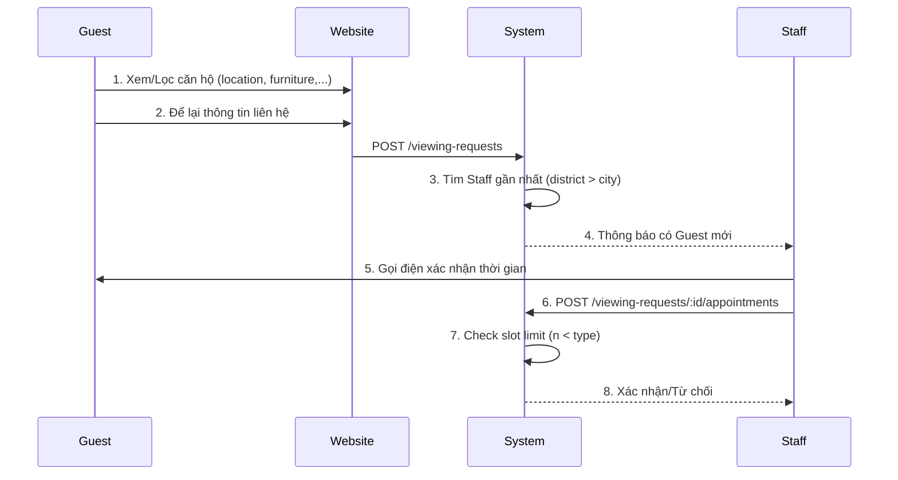

# Guest Viewing Flow (Luồng Xem Căn Hộ)

## Tổng Quan

Luồng xem căn hộ cho phép Guest đăng ký xem căn hộ, hệ thống tự động gán Staff phù hợp, và Staff tạo lịch hẹn.

---

## Flow Diagram



---

## API Endpoints

### 1. Guest Submit Viewing Request

```
POST /viewing-requests (Public)
```

**Request:**
```json
{
  "apartmentId": "uuid",
  "fullName": "Nguyen Van A",
  "email": "guest@email.com",
  "phone": "0901234567",
  "preferredMoveInDate": "2026-02-15",
  "message": "Looking for 2BR apartment",
  "numberOfOccupants": 2
}
```

**Response:** Request ID + assigned Staff info

---

### 2. Staff Get Assigned Requests

```
GET /viewing-requests/my-assigned (Staff Auth)
```

Trả về danh sách requests trong khu vực làm việc của Staff (dựa trên `workingDistrict`/`workingCity`).

---

### 3. Staff Create Appointment

```
POST /viewing-requests/:id/appointments (Staff Auth)
```

**Request:**
```json
{
  "appointmentDate": "2026-02-10",
  "appointmentTime": "14:00",
  "durationMinutes": 30,
  "meetingLocation": "Lobby",
  "staffNotes": "Guest muốn xem 2 căn"
}
```

**Slot Limit Logic:**
- Hệ thống check số lượng appointments đang có tại cùng `buildingName` + `apartmentType` + `time slot`
- Nếu `existing >= maxConcurrentViewings` → Từ chối với lỗi 409

---

### 4. View Apartment Schedule

```
GET /viewing-requests/apartments/:apartmentId/appointments?date=2026-02-10 (Staff Auth)
```

Staff xem lịch appointments của căn hộ để biết slot nào đã có người.

---

## Schema Updates

| Model | Field | Description |
|-------|-------|-------------|
| **Staff** | `workingCity` | Thành phố làm việc |
| **Staff** | `workingDistrict` | Quận/Huyện làm việc |
| **Apartment** | `apartmentType` | Loại căn hộ (VIP, NORMAL) |
| **Apartment** | `maxConcurrentViewings` | Số lượng xem cùng lúc (default: 2) |

---

## Staff Assignment Logic

```
1. Tìm Staff có workingDistrict = apartment.district
2. Nếu không có → Tìm Staff có workingCity = apartment.city  
3. Nếu không có → Lấy Staff active bất kỳ
```
