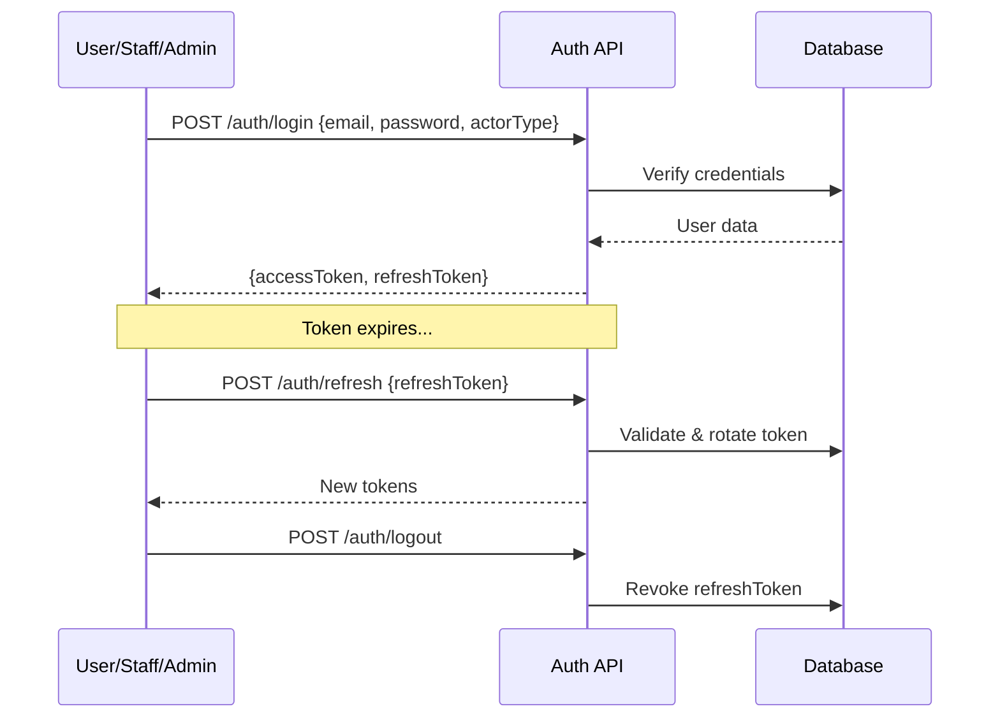
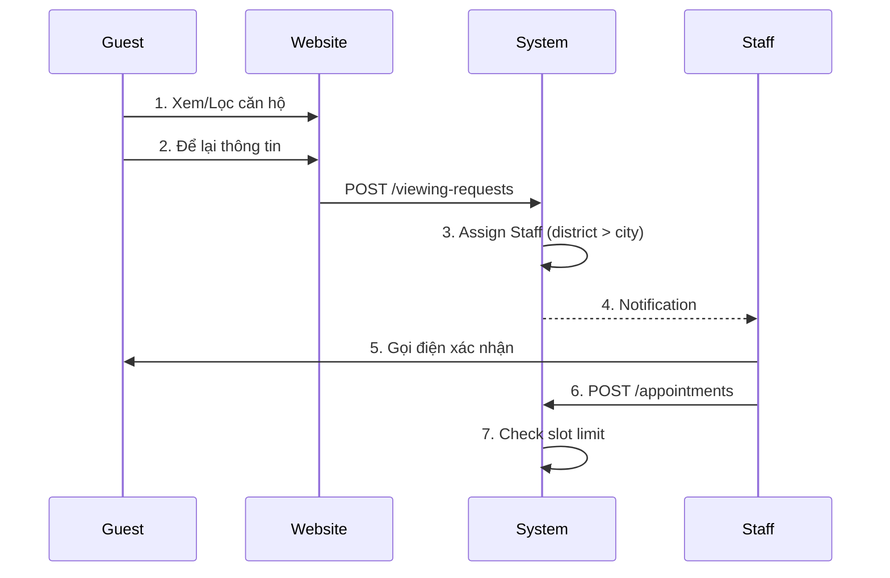
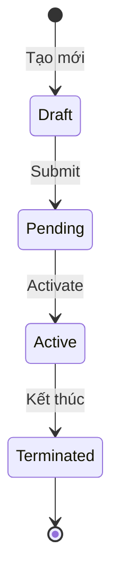
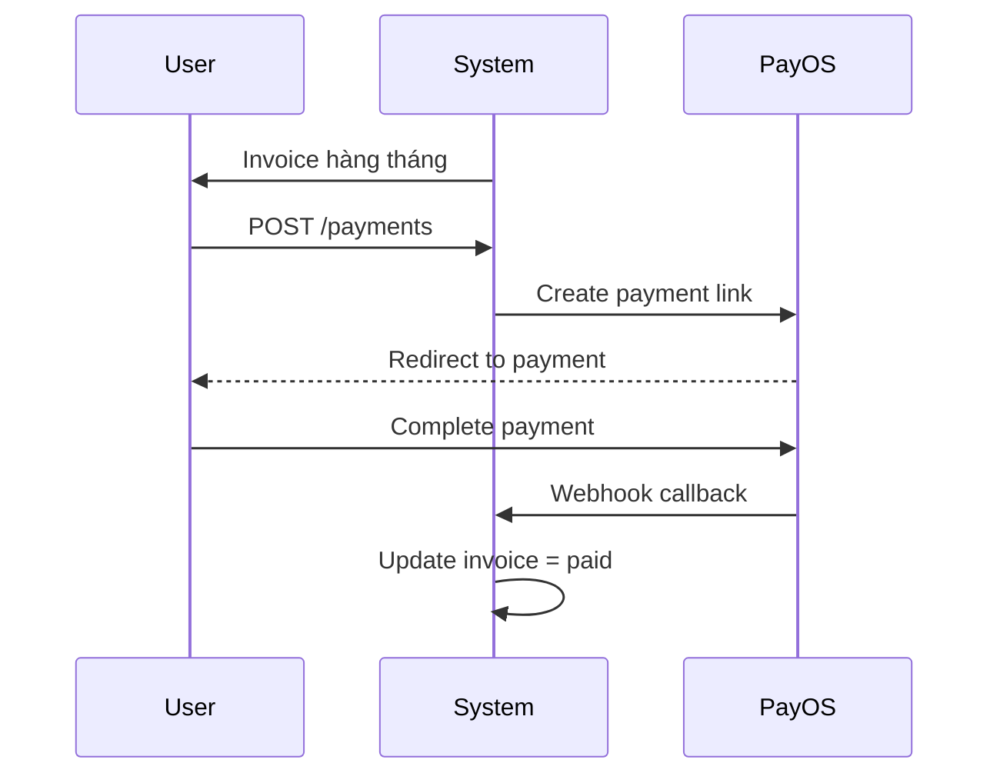
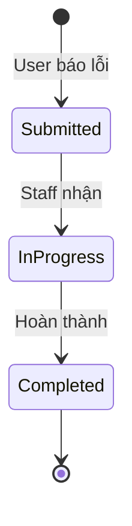
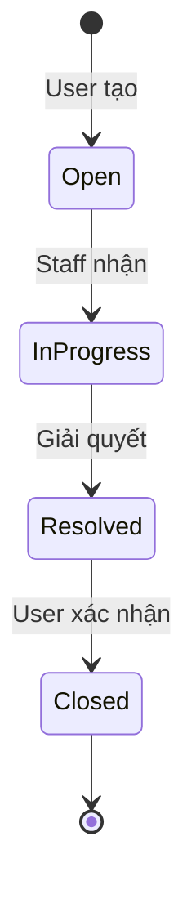
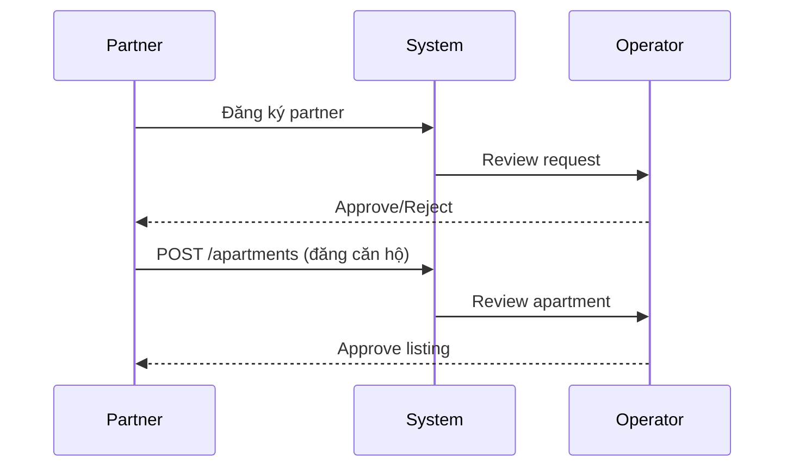
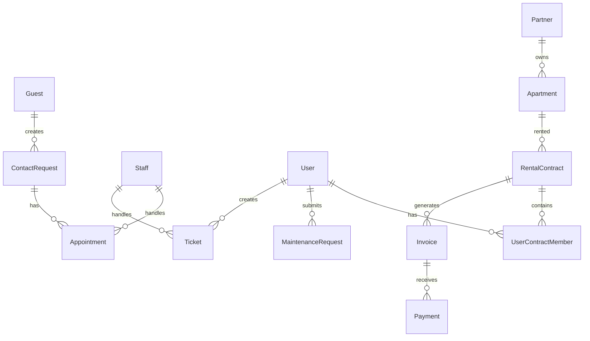

# IntelliRentOps - Main System Flows

Tài liệu mô tả tất cả các luồng nghiệp vụ chính trong hệ thống quản lý cho thuê căn hộ.

---

## Mục Lục

1. [Actors & Roles](#actors--roles)
2. [Authentication Flow](#1-authentication-flow)
3. [Guest Viewing Flow](#2-guest-viewing-flow)
4. [Contract Flow](#3-contract-flow)
5. [Payment Flow](#4-payment-flow)
6. [Maintenance Flow](#5-maintenance-flow)
7. [Ticket Flow](#6-ticket-flow)
8. [Partner Flow](#7-partner-flow)

---

## Actors & Roles

| Actor | Mô tả | Permissions |
|-------|-------|-------------|
| **Guest** | Khách vãng lai, chưa đăng ký | Xem căn hộ, submit viewing request |
| **User** | Người thuê căn hộ | Xem hợp đồng, thanh toán, tạo ticket |
| **Staff** | Nhân viên | Quản lý appointments, maintenance, tickets |
| **Operator** | Điều hành viên | Duyệt căn hộ, quản lý bookings |
| **Admin** | Quản trị viên | Full access |
| **Partner** | Đối tác/Chủ nhà | Đăng căn hộ, xem thống kê |

---

## 1. Authentication Flow

**Endpoints:**
- `POST /auth/login` - Đăng nhập (multi-actor)
- `POST /auth/refresh` - Làm mới token
- `POST /auth/logout` - Đăng xuất

---

## 2. Guest Viewing Flow

**Endpoints:**
- `GET /apartments` - Tìm kiếm căn hộ (public)
- `POST /viewing-requests` - Submit yêu cầu xem (public)
- `GET /viewing-requests/my-assigned` - Staff xem requests
- `POST /viewing-requests/:id/appointments` - Staff tạo lịch hẹn

**Staff Assignment Logic:**
1. Tìm Staff có `workingDistrict` = apartment.district
2. Fallback: Staff có `workingCity` = apartment.city
3. Fallback: Staff active bất kỳ

---

## 3. Contract Flow

**User Journey:**
1. Guest xem căn hộ → Staff tạo appointment
2. Guest đồng ý → Operator tạo contract (draft)
3. Ký hợp đồng → Active (apartment → occupied)
4. Hết hạn/Chấm dứt → Terminated (apartment → available)

**Endpoints:**
- `POST /contracts` - Tạo hợp đồng
- `PATCH /contracts/:id/activate` - Kích hoạt
- `PATCH /contracts/:id/terminate` - Chấm dứt
- `GET /contracts` - Danh sách (user chỉ thấy của mình)

---

## 4. Payment Flow

**Invoice Lifecycle:**
- `draft` → `issued` → `sent` → `paid` / `overdue`

**Endpoints:**
- `GET /invoices` - Danh sách hóa đơn
- `POST /payments` - Tạo thanh toán
- `PATCH /payments/:id/confirm` - Xác nhận (staff/webhook)
- `POST /payments/webhook` - PayOS callback

---

## 5. Maintenance Flow

**User Journey:**
1. User phát hiện vấn đề (điều hòa hỏng, ống nước rò,...)
2. Tạo maintenance request với ảnh, mô tả
3. Staff nhận → Đến sửa → Cập nhật completion notes/cost

**Endpoints:**
- `POST /maintenance` - Tạo yêu cầu bảo trì
- `GET /maintenance` - Danh sách (user: của mình, staff: được gán)
- `PATCH /maintenance/:id/complete` - Đánh dấu hoàn thành

---

## 6. Ticket Flow

**Categories:** billing, contract, account, complaint, inquiry, documentation

**Endpoints:**
- `POST /tickets` - Tạo ticket
- `GET /tickets` - Danh sách
- `PATCH /tickets/:id/assign` - Gán cho staff
- `PATCH /tickets/:id/resolve` - Đánh dấu đã giải quyết
- `PATCH /tickets/:id/close` - Đóng ticket

---

## 7. Partner Flow

**Endpoints:**
- `POST /apartments` - Partner đăng căn hộ
- `PATCH /apartments/:id/approve` - Operator duyệt
- `GET /apartments` - Partner xem căn hộ của mình

---

## Entity Relationships

---

## API Summary by Actor

### Guest (Public)
| Method | Endpoint | Description |
|--------|----------|-------------|
| GET | `/apartments` | Tìm kiếm căn hộ |
| GET | `/apartments/:id` | Chi tiết căn hộ |
| POST | `/viewing-requests` | Submit yêu cầu xem |

### User
| Method | Endpoint | Description |
|--------|----------|-------------|
| GET | `/contracts` | Hợp đồng của tôi |
| GET | `/invoices` | Hóa đơn của tôi |
| POST | `/payments` | Thanh toán |
| POST | `/maintenance` | Báo lỗi/bảo trì |
| POST | `/tickets` | Tạo ticket hỗ trợ |

### Staff
| Method | Endpoint | Description |
|--------|----------|-------------|
| GET | `/viewing-requests/my-assigned` | Requests được gán |
| POST | `/viewing-requests/:id/appointments` | Tạo lịch hẹn |
| PATCH | `/maintenance/:id/complete` | Hoàn thành bảo trì |
| PATCH | `/tickets/:id/resolve` | Giải quyết ticket |

### Operator
| Method | Endpoint | Description |
|--------|----------|-------------|
| PATCH | `/apartments/:id/approve` | Duyệt căn hộ |
| POST | `/contracts` | Tạo hợp đồng |
| PATCH | `/contracts/:id/activate` | Kích hoạt hợp đồng |

### Admin
Full access to all endpoints.
