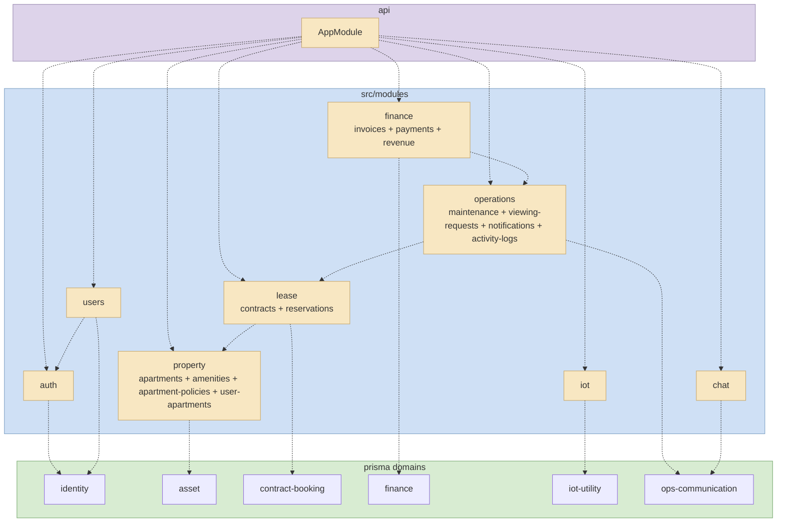
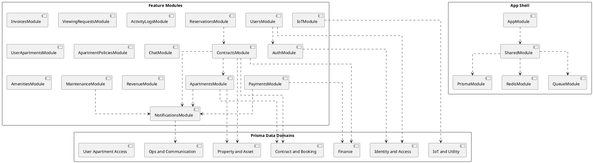

# IntelliServOps Package Diagram Guide (Modules + Prisma)

## 1) Goal

This document provides a ready-to-draw package diagram blueprint for the current backend architecture.
It combines:

- NestJS module packages (application layer)
- Prisma data domains (data layer)
- Dependency rules between packages

Use this as the single source when drawing a package diagram similar to your sample image.

## 2) Current Top-Level Backend Packages

### 2.1 App Shell

- AppModule (composition root)
- SharedModule (global infra)

### 2.2 Feature Modules currently wired in AppModule

- AuthModule
- UsersModule
- ApartmentsModule
- ContractsModule
- InvoicesModule
- PaymentsModule
- MaintenanceModule
- ViewingRequestsModule
- IoTModule
- NotificationsModule
- ActivityLogsModule
- UserApartmentsModule
- ApartmentPoliciesModule
- ReservationsModule
- ChatModule
- AmenitiesModule
- RevenueModule

## 3) Module Dependency Map (Application Layer)

### 3.1 Core/Infra dependencies

- AppModule -> SharedModule
- SharedModule -> PrismaModule
- SharedModule -> RedisModule
- SharedModule -> QueueModule

### 3.2 Feature-to-feature dependencies (explicit module imports)

- UsersModule -> AuthModule
- ApartmentsModule -> NotificationsModule
- ContractsModule -> ApartmentsModule
- ContractsModule -> NotificationsModule
- PaymentsModule -> NotificationsModule
- MaintenanceModule -> NotificationsModule
- ReservationsModule -> ContractsModule

### 3.3 Feature modules with no explicit feature import

- InvoicesModule
- ViewingRequestsModule
- IoTModule
- NotificationsModule
- ActivityLogsModule
- UserApartmentsModule
- ApartmentPoliciesModule
- ChatModule
- AmenitiesModule
- RevenueModule

## 4) Prisma Data Domains (Data Layer)

Below is a practical grouping for package drawing.

### 4.1 Identity and Access Domain

- User
- UserIdentity
- Staff
- Operator
- Admin
- RefreshToken
- PasswordResetToken
- OtpVerification
- PendingGuestRegistration

### 4.2 Property and Asset Domain

- Apartment
- Amenity
- ApartmentAmenity
- Room
- ApartmentRating
- PartnerCooperationContract
- CooperationCommissionPhase

### 4.3 Contract and Booking Domain

- RentalContract
- UserContractMember
- Reservation
- ContactRequest
- BookingRequest
- Appointment

### 4.4 Finance Domain

- Invoice
- Payment
- PartnerMonthlyPayout
- PartnerPayoutTransfer

### 4.5 IoT and Utility Domain

- IoTBoard
- IoTDevice
- UtilityMeter
- UtilityReading

### 4.6 Operations and Communication Domain

- MaintenanceRequest
- Task
- ChatConversation
- ChatMessage
- Notification
- FcmToken
- ActivityLog

### 4.7 User Apartment Access Domain

- UserApartment
- ApartmentPolicy
- Policy

## 5) Module -> Prisma Domain Mapping (for package arrows)

Use these mappings to connect feature packages to data packages in your diagram:

- AuthModule -> Identity and Access
- UsersModule -> Identity and Access
- ApartmentsModule -> Property and Asset, Contract and Booking
- AmenitiesModule -> Property and Asset
- ContractsModule -> Contract and Booking, Finance, Property and Asset
- ReservationsModule -> Contract and Booking, Identity and Access
- InvoicesModule -> Finance
- PaymentsModule -> Finance, Property and Asset
- RevenueModule -> Finance
- MaintenanceModule -> Operations and Communication, Contract and Booking
- ViewingRequestsModule -> Contract and Booking, Identity and Access
- IoTModule -> IoT and Utility, Property and Asset
- ChatModule -> Operations and Communication
- NotificationsModule -> Operations and Communication
- ActivityLogsModule -> Operations and Communication
- UserApartmentsModule -> User Apartment Access
- ApartmentPoliciesModule -> User Apartment Access

## 6) Drawing Rules (to match package diagram style)

- Use layered layout:
  - Layer 1: App Shell
  - Layer 2: Feature Modules
  - Layer 3: Data Domains (Prisma)
- Use dashed arrows for package dependency.
- Keep arrow direction one-way (consumer -> provider).
- Avoid crossing arrows by clustering related modules near each other.

Suggested clusters:

- Customer flow: Auth, Users, Apartments, Reservations, Contracts
- Operations flow: Maintenance, ViewingRequests, Notifications, ActivityLogs
- Platform flow: Payments, Invoices, Revenue, IoT, Chat
- Governance flow: ApartmentPolicies, UserApartments, Amenities

## 7) Mermaid Final (optimized, simple)

Use this version when you need a clean package diagram similar to your sample image (minimal detail, easy to read).

## 8) PlantUML Template (if you use UML tools)

## 9) Notes for keeping the diagram updated

- When adding a new module: update Sections 2, 3, 5.
- When adding/removing Prisma model groups: update Section 4.
- Keep one version for architecture overview (high-level), and optionally a second version with detailed model names.
