# IntelliServOps State Machine Catalog

> Scope: Tat ca model co field `status` trong [prisma/schema.prisma](prisma/schema.prisma), transition chi tinh transition co chung cu tu code/API.
>
> Cap nhat lan cuoi: 2026-04-20

Draw.io source:

- [database/IntelliServOps_state_machines.drawio](database/IntelliServOps_state_machines.drawio)
- Generator script: [database/generate_state_machines_drawio.js](database/generate_state_machines_drawio.js)

---

## 1. Inventory (21 Models)

| Model                      | Enum                             | Default   |
| -------------------------- | -------------------------------- | --------- |
| Apartment                  | ApartmentStatus                  | available |
| PartnerCooperationContract | PartnerCooperationContractStatus | draft     |
| Room                       | RoomStatus                       | available |
| RentalContract             | ContractStatus                   | draft     |
| UserContractMember         | MemberStatus                     | active    |
| ContactRequest             | ContactRequestStatus             | new       |
| BookingRequest             | BookingStatus                    | pending   |
| Reservation                | ReservationStatus                | pending   |
| Appointment                | AppointmentStatus                | scheduled |
| Task                       | TaskStatus                       | pending   |
| MaintenanceRequest         | MaintenanceStatus                | submitted |
| Invoice                    | InvoiceStatus                    | draft     |
| Payment                    | PaymentStatus                    | pending   |
| PartnerMonthlyPayout       | PartnerMonthlyPayoutStatus       | pending   |
| IoTBoard                   | IoTStatus                        | active    |
| IoTDevice                  | IoTStatus                        | active    |
| UtilityMeter               | MeterStatus                      | active    |
| UserApartment              | UserApartmentStatus              | active    |
| ActivityLog                | ActivityStatus                   | success   |
| PendingGuestRegistration   | PendingRegistrationStatus        | pending   |
| ChatConversation           | ConversationStatus               | active    |

---

## 2. Asset Domain

### 2.1 Apartment (ApartmentStatus)

Enum values:

- available
- occupied
- maintenance
- reserved
- inactive
- verified
- pending

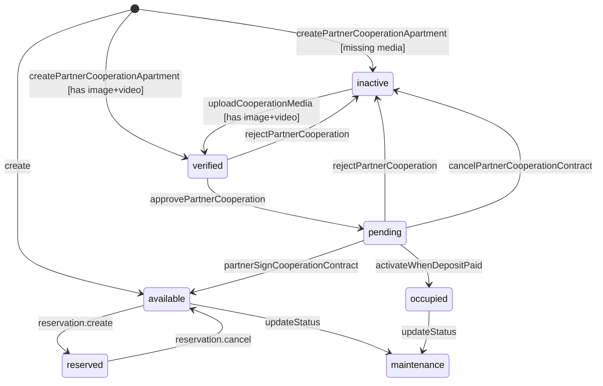

Evidence:

- create available: [src/modules/apartments/apartments.service.ts#L1107](src/modules/apartments/apartments.service.ts#L1107)
- create inactive/verified: [src/modules/apartments/apartments.service.ts#L1202](src/modules/apartments/apartments.service.ts#L1202)
- inactive -> verified: [src/modules/apartments/apartments.service.ts#L1312](src/modules/apartments/apartments.service.ts#L1312)
- verified -> pending: [src/modules/apartments/apartments.service.ts#L1876](src/modules/apartments/apartments.service.ts#L1876)
- pending -> available: [src/modules/apartments/apartments.service.ts#L2012](src/modules/apartments/apartments.service.ts#L2012)
- pending/verified -> inactive: [src/modules/apartments/apartments.service.ts#L1427](src/modules/apartments/apartments.service.ts#L1427)
- pending -> inactive (partner cancel): [src/modules/apartments/apartments.service.ts#L2126](src/modules/apartments/apartments.service.ts#L2126)
- available -> reserved: [src/modules/reservations/reservations.service.ts#L163](src/modules/reservations/reservations.service.ts#L163)
- reserved -> available: [src/modules/reservations/reservations.service.ts#L445](src/modules/reservations/reservations.service.ts#L445)
- pending/signed -> occupied via contract activation: [src/modules/contracts/contracts.service.ts#L2319](src/modules/contracts/contracts.service.ts#L2319)
- manual update status endpoint: [src/modules/apartments/apartments.service.ts#L1720](src/modules/apartments/apartments.service.ts#L1720)

Coverage:

- used-in-transition: available, occupied, maintenance, reserved, inactive, verified, pending
- default-only: none
- unobserved: none

### 2.2 Room (RoomStatus)

Enum values:

- available
- occupied
- maintenance

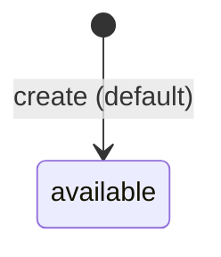

Evidence:

- default available in schema only: [prisma/schema.prisma#L794](prisma/schema.prisma#L794)
- khong tim thay update Room.status trong service production.

Coverage:

- used-in-transition: none
- default-only: available
- unobserved: occupied, maintenance

### 2.3 IoTBoard (IoTStatus)

Enum values:

- active
- inactive
- maintenance
- error

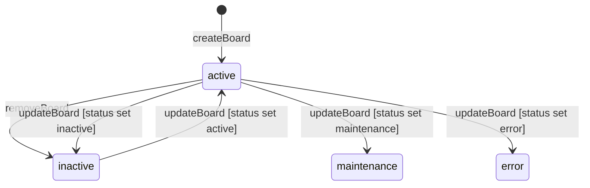

Evidence:

- create default active: [src/modules/iot/iot.service.ts#L196](src/modules/iot/iot.service.ts#L196)
- remove -> inactive: [src/modules/iot/iot.service.ts#L305](src/modules/iot/iot.service.ts#L305)
- update status via board update DTO/service: [src/modules/iot/iot.controller.ts#L154](src/modules/iot/iot.controller.ts#L154)
- update board status write path: [src/modules/iot/iot.service.ts#L257](src/modules/iot/iot.service.ts#L257)
- status enum accepted by DTO: [src/modules/iot/dto/update-iot-board.dto.ts#L20](src/modules/iot/dto/update-iot-board.dto.ts#L20)

Coverage:

- used-in-transition: active, inactive, maintenance, error
- default-only: none
- unobserved: none

### 2.4 IoTDevice (IoTStatus)

Enum values:

- active
- inactive
- maintenance
- error

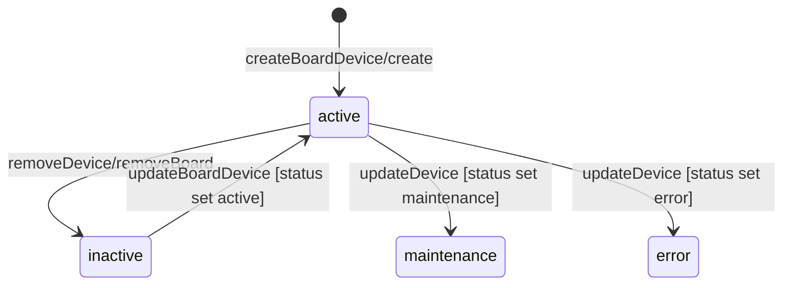

Evidence:

- default active: [src/modules/iot/iot.service.ts#L839](src/modules/iot/iot.service.ts#L839)
- remove -> inactive: [src/modules/iot/iot.service.ts#L1022](src/modules/iot/iot.service.ts#L1022)
- board remove cascades child devices inactive: [src/modules/iot/iot.service.ts#L315](src/modules/iot/iot.service.ts#L315)
- device update path (status in DTO payload): [src/modules/iot/iot.service.ts#L892](src/modules/iot/iot.service.ts#L892)
- status enum accepted by DTO: [src/modules/iot/dto/update-iot-device.dto.ts#L8](src/modules/iot/dto/update-iot-device.dto.ts#L8)

Coverage:

- used-in-transition: active, inactive, maintenance, error
- default-only: none
- unobserved: none

### 2.5 UtilityMeter (MeterStatus)

Enum values:

- active
- inactive
- faulty
- replaced

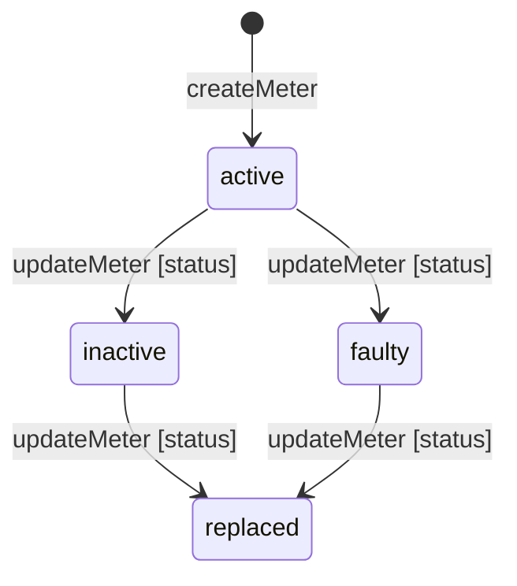

Evidence:

- create default active: [src/modules/iot/iot.service.ts#L1194](src/modules/iot/iot.service.ts#L1194)
- update status through updateMeter payload: [src/modules/iot/iot.service.ts#L1219](src/modules/iot/iot.service.ts#L1219)
- status enum accepted by DTO: [src/modules/iot/dto/update-utility-meter.dto.ts#L8](src/modules/iot/dto/update-utility-meter.dto.ts#L8)

Coverage:

- used-in-transition: active, inactive, faulty, replaced
- default-only: none
- unobserved: none

---

## 3. Contract And Membership Domain

### 3.1 RentalContract (ContractStatus)

Enum values:

- draft
- pending
- signed
- active
- expired
- terminated
- renewed

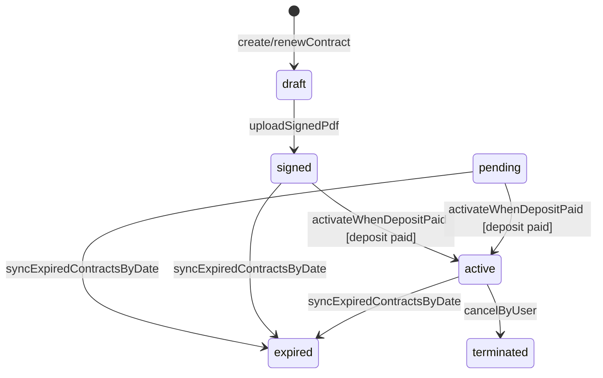

Evidence:

- draft create: [src/modules/contracts/contracts.service.ts#L1977](src/modules/contracts/contracts.service.ts#L1977)
- signed via upload: [src/modules/contracts/contracts.service.ts#L1605](src/modules/contracts/contracts.service.ts#L1605)
- pending/signed -> active: [src/modules/contracts/contracts.service.ts#L2313](src/modules/contracts/contracts.service.ts#L2313)
- pending/signed/active -> expired: [src/modules/contracts/contracts.service.ts#L315](src/modules/contracts/contracts.service.ts#L315)
- active -> terminated (user cancel): [src/modules/contracts/contracts.service.ts#L2199](src/modules/contracts/contracts.service.ts#L2199)
- renewContract tao contract moi status draft: [src/modules/contracts/contracts.service.ts#L2728](src/modules/contracts/contracts.service.ts#L2728)

Coverage:

- used-in-transition: draft, signed, active, expired, terminated
- default-only: pending (duoc dung trong guard va cron, chua co explicit write pending)
- unobserved: renewed (chi co enum value, khong thay write status renewed)

### 3.2 PartnerCooperationContract (PartnerCooperationContractStatus)

Enum values:

- draft
- pending
- signed
- active
- expired
- terminated
- cancelled

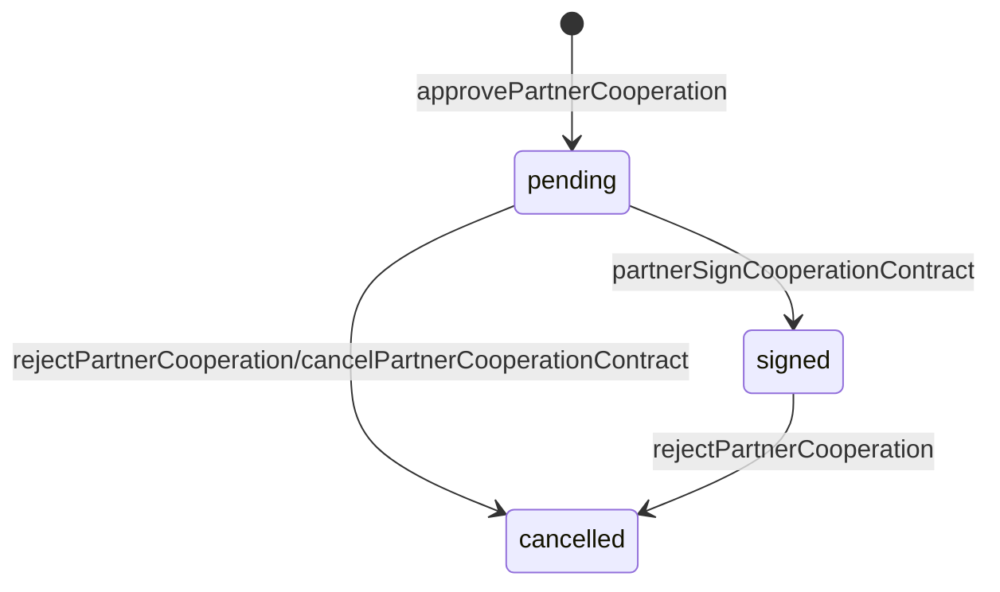

Evidence:

- create pending: [src/modules/apartments/apartments.service.ts#L1859](src/modules/apartments/apartments.service.ts#L1859)
- pending -> signed: [src/modules/apartments/apartments.service.ts#L1998](src/modules/apartments/apartments.service.ts#L1998)
- draft/pending/signed/active -> cancelled (reject): [src/modules/apartments/apartments.service.ts#L1418](src/modules/apartments/apartments.service.ts#L1418)
- pending/signed/... -> cancelled (partner cancel): [src/modules/apartments/apartments.service.ts#L2110](src/modules/apartments/apartments.service.ts#L2110)

Coverage:

- used-in-transition: pending, signed, cancelled
- default-only: none
- unobserved: draft, active, expired, terminated

### 3.3 UserContractMember (MemberStatus)

Enum values:

- active
- moved_out
- inactive

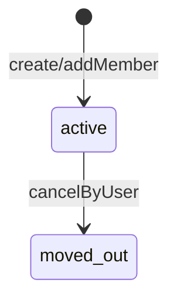

Evidence:

- create active: [src/modules/contracts/contracts.service.ts#L1997](src/modules/contracts/contracts.service.ts#L1997)
- add member active: [src/modules/contracts/contracts.service.ts#L2448](src/modules/contracts/contracts.service.ts#L2448)
- moved_out on contract cancel: [src/modules/contracts/contracts.service.ts#L2228](src/modules/contracts/contracts.service.ts#L2228)

Coverage:

- used-in-transition: active, moved_out
- default-only: none
- unobserved: inactive

### 3.4 UserApartment (UserApartmentStatus)

Enum values:

- active
- moved_out
- inactive

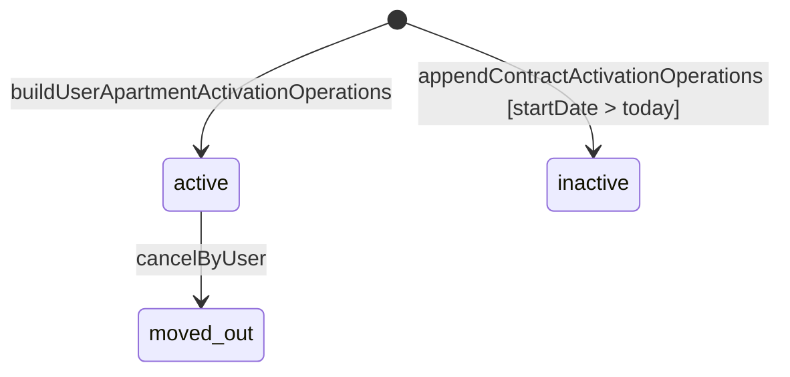

Evidence:

- active create/upsert: [src/modules/contracts/contracts.service.ts#L286](src/modules/contracts/contracts.service.ts#L286)
- inactive in delayed activation path: [src/modules/payments/payments.service.ts#L1516](src/modules/payments/payments.service.ts#L1516)
- moved_out on contract cancel: [src/modules/contracts/contracts.service.ts#L2234](src/modules/contracts/contracts.service.ts#L2234)

Coverage:

- used-in-transition: active, moved_out, inactive
- default-only: none
- unobserved: none

---

## 4. Request And Scheduling Domain

### 4.1 ContactRequest (ContactRequestStatus)

Enum values:

- new
- contacted
- scheduled
- converted
- lost
- spam

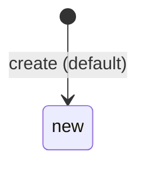

Evidence:

- default in schema: [prisma/schema.prisma#L920](prisma/schema.prisma#L920)
- khong thay write ContactRequestStatus.\* trong service production.

Coverage:

- used-in-transition: none
- default-only: new
- unobserved: contacted, scheduled, converted, lost, spam

### 4.2 BookingRequest (BookingStatus)

Enum values:

- pending
- approved
- rejected
- cancelled
- expired

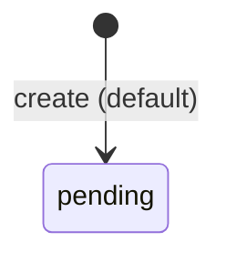

Evidence:

- default in schema: [prisma/schema.prisma#L958](prisma/schema.prisma#L958)
- khong thay write BookingStatus.\* trong service production.

Coverage:

- used-in-transition: none
- default-only: pending
- unobserved: approved, rejected, cancelled, expired

### 4.3 Reservation (ReservationStatus)

Enum values:

- pending
- confirmed
- cancelled
- expired

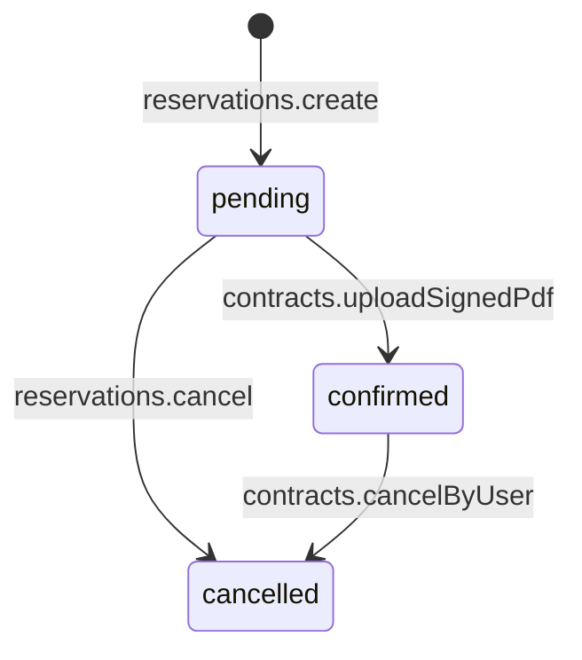

Evidence:

- create pending: [src/modules/reservations/reservations.service.ts#L194](src/modules/reservations/reservations.service.ts#L194)
- pending -> confirmed: [src/modules/contracts/contracts.service.ts#L1624](src/modules/contracts/contracts.service.ts#L1624)
- pending -> cancelled: [src/modules/reservations/reservations.service.ts#L452](src/modules/reservations/reservations.service.ts#L452)
- any createdContract -> cancelled on contract cancel: [src/modules/contracts/contracts.service.ts#L2193](src/modules/contracts/contracts.service.ts#L2193)

Coverage:

- used-in-transition: pending, confirmed, cancelled
- default-only: none
- unobserved: expired

### 4.4 Appointment (AppointmentStatus)

Enum values:

- scheduled
- confirmed
- completed
- cancelled
- no_show

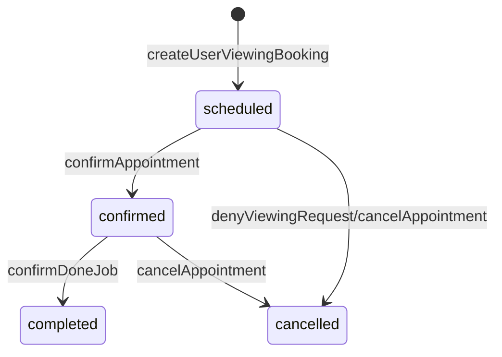

Evidence:

- create scheduled: [src/modules/viewing-requests/viewing-requests.service.ts#L212](src/modules/viewing-requests/viewing-requests.service.ts#L212)
- scheduled -> confirmed: [src/modules/viewing-requests/viewing-requests.service.ts#L476](src/modules/viewing-requests/viewing-requests.service.ts#L476)
- scheduled -> cancelled: [src/modules/viewing-requests/viewing-requests.service.ts#L588](src/modules/viewing-requests/viewing-requests.service.ts#L588)
- confirmed/scheduled -> cancelled: [src/modules/viewing-requests/viewing-requests.service.ts#L814](src/modules/viewing-requests/viewing-requests.service.ts#L814)
- confirmed -> completed: [src/modules/viewing-requests/viewing-requests.service.ts#L685](src/modules/viewing-requests/viewing-requests.service.ts#L685)

Coverage:

- used-in-transition: scheduled, confirmed, completed, cancelled
- default-only: none
- unobserved: no_show

### 4.5 PendingGuestRegistration (PendingRegistrationStatus)

Enum values:

- pending
- otp_sent
- verified
- completed
- expired
- cancelled


Evidence:

- default schema: [prisma/schema.prisma#L1616](prisma/schema.prisma#L1616)
- khong tim thay logic transition trong service production (chi thay trong [src/modules/auth/auth.service.ts.bak](src/modules/auth/auth.service.ts.bak)).

Coverage:

- used-in-transition: none
- default-only: pending
- unobserved: otp_sent, verified, completed, expired, cancelled

---

## 5. Operations Domain

### 5.1 Task (TaskStatus)

Enum values:

- pending
- assigned
- in_progress
- completed
- cancelled

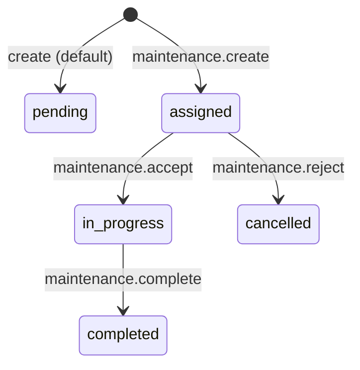

Evidence:

- maintenance create task assigned: [src/modules/maintenance/maintenance.service.ts#L503](src/modules/maintenance/maintenance.service.ts#L503)
- assigned -> in_progress: [src/modules/maintenance/maintenance.service.ts#L694](src/modules/maintenance/maintenance.service.ts#L694)
- assigned -> cancelled: [src/modules/maintenance/maintenance.service.ts#L752](src/modules/maintenance/maintenance.service.ts#L752)
- in_progress -> completed: [src/modules/maintenance/maintenance.service.ts#L816](src/modules/maintenance/maintenance.service.ts#L816)

Coverage:

- used-in-transition: assigned, in_progress, completed, cancelled
- default-only: pending
- unobserved: none

### 5.2 MaintenanceRequest (MaintenanceStatus)

Enum values:

- submitted
- acknowledged
- scheduled
- in_progress
- completed
- cancelled

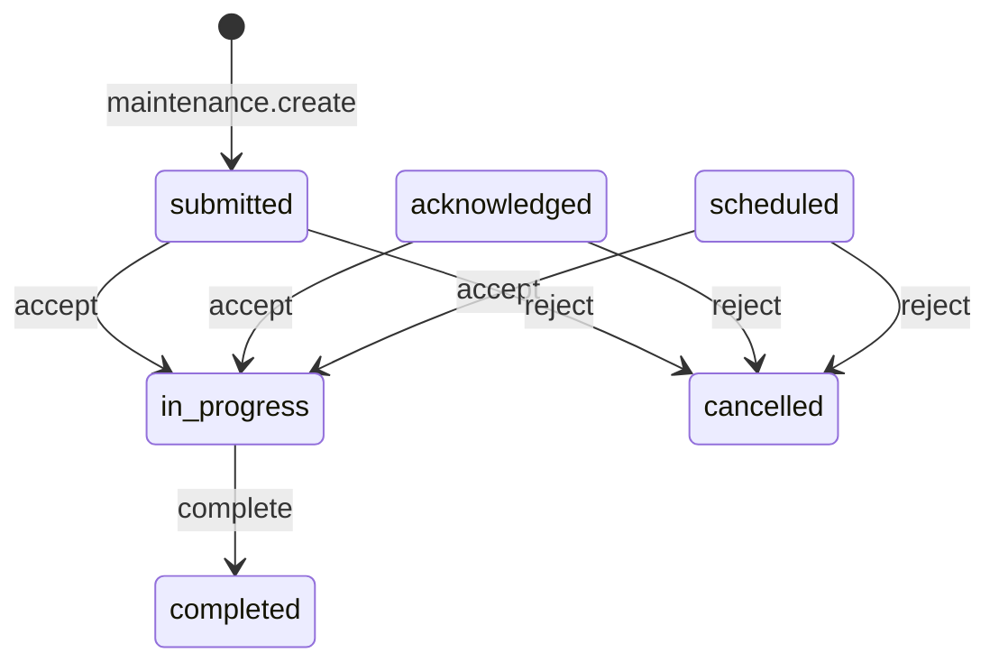

Evidence:

- create submitted: [src/modules/maintenance/maintenance.service.ts#L525](src/modules/maintenance/maintenance.service.ts#L525)
- -> in_progress (accept): [src/modules/maintenance/maintenance.service.ts#L680](src/modules/maintenance/maintenance.service.ts#L680)
- -> cancelled (reject): [src/modules/maintenance/maintenance.service.ts#L736](src/modules/maintenance/maintenance.service.ts#L736)
- in_progress/acknowledged/scheduled -> completed: [src/modules/maintenance/maintenance.service.ts#L804](src/modules/maintenance/maintenance.service.ts#L804)

Coverage:

- used-in-transition: submitted, acknowledged, scheduled, in_progress, completed, cancelled
- default-only: none
- unobserved: none

---

## 6. Finance Domain

### 6.1 Invoice (InvoiceStatus)

Enum values:

- draft
- issued
- sent
- partially_paid
- paid
- overdue
- cancelled

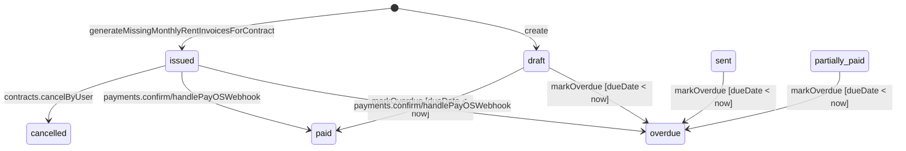

Evidence:

- create draft: [src/modules/invoices/invoices.service.ts#L1357](src/modules/invoices/invoices.service.ts#L1357)
- create issued (contract invoice generation): [src/modules/contracts/contracts.service.ts#L718](src/modules/contracts/contracts.service.ts#L718)
- any due -> overdue: [src/modules/invoices/invoices.service.ts#L1393](src/modules/invoices/invoices.service.ts#L1393)
- -> paid via payment confirm: [src/modules/payments/payments.service.ts#L957](src/modules/payments/payments.service.ts#L957)
- -> paid via webhook: [src/modules/payments/payments.service.ts#L1350](src/modules/payments/payments.service.ts#L1350)
- -> cancelled on contract cancel: [src/modules/contracts/contracts.service.ts#L2220](src/modules/contracts/contracts.service.ts#L2220)

Coverage:

- used-in-transition: draft, issued, paid, overdue, cancelled
- default-only: none
- unobserved: sent, partially_paid

### 6.2 Payment (PaymentStatus)

Enum values:

- pending
- processing
- completed
- failed
- refunded
- cancelled

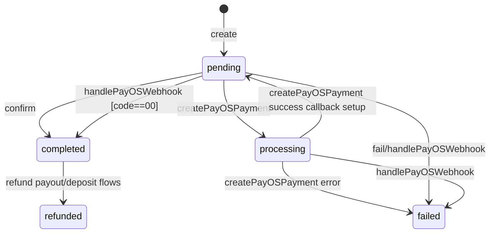

Evidence:

- create pending: [src/modules/payments/payments.service.ts#L762](src/modules/payments/payments.service.ts#L762)
- pending -> completed: [src/modules/payments/payments.service.ts#L951](src/modules/payments/payments.service.ts#L951)
- pending -> processing: [src/modules/payments/payments.service.ts#L1197](src/modules/payments/payments.service.ts#L1197)
- processing -> pending (after payos link): [src/modules/payments/payments.service.ts#L1231](src/modules/payments/payments.service.ts#L1231)
- processing -> failed: [src/modules/payments/payments.service.ts#L1251](src/modules/payments/payments.service.ts#L1251)
- pending/processing -> failed webhook: [src/modules/payments/payments.service.ts#L1393](src/modules/payments/payments.service.ts#L1393)
- pending/processing -> completed webhook: [src/modules/payments/payments.service.ts#L1330](src/modules/payments/payments.service.ts#L1330)
- -> refunded: [src/modules/payments/payments.service.ts#L626](src/modules/payments/payments.service.ts#L626)

Coverage:

- used-in-transition: pending, processing, completed, failed, refunded
- default-only: none
- unobserved: cancelled

### 6.3 PartnerMonthlyPayout (PartnerMonthlyPayoutStatus)

Enum values:

- pending
- paid
- cancelled

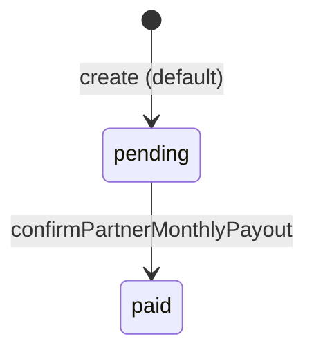

Evidence:

- pending -> paid: [src/modules/payments/payments.service.ts#L272](src/modules/payments/payments.service.ts#L272)

Coverage:

- used-in-transition: paid
- default-only: pending
- unobserved: cancelled

---

## 7. Platform Domain

### 7.1 ActivityLog (ActivityStatus)

Enum values:

- success
- failure
- pending

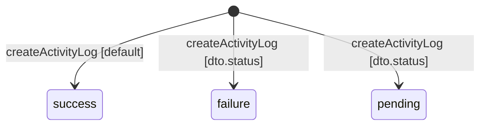

Evidence:

- default success: [src/modules/activity-logs/activity-logs.service.ts#L75](src/modules/activity-logs/activity-logs.service.ts#L75)
- explicit success in helper: [src/modules/activity-logs/activity-logs.service.ts#L103](src/modules/activity-logs/activity-logs.service.ts#L103)

Coverage:

- used-in-transition: success, failure, pending
- default-only: none
- unobserved: none

### 7.2 ChatConversation (ConversationStatus)

Enum values:

- active
- closed
- archived

```mermaid
stateDiagram-v2
    [*] --> active: createConversation
    closed --> active: createOrReuseConversation
    active --> archived: archiveConversation
    closed --> archived: archiveConversation
```

Evidence:

- create active: [src/modules/chat/chat.service.ts#L99](src/modules/chat/chat.service.ts#L99)
- closed -> active reuse: [src/modules/chat/chat.service.ts#L74](src/modules/chat/chat.service.ts#L74)
- active/closed -> archived: [src/modules/chat/chat.service.ts#L399](src/modules/chat/chat.service.ts#L399)
- archived khong duoc sendMessage: [src/modules/chat/chat.service.ts#L232](src/modules/chat/chat.service.ts#L232)

Coverage:

- used-in-transition: active, closed, archived
- default-only: none
- unobserved: khong thay explicit write path active -> closed trong production code

---

## 8. Cross-Entity Coupling

- Reservation create/cancel dong bo Apartment status:
  - [src/modules/reservations/reservations.service.ts#L163](src/modules/reservations/reservations.service.ts#L163)
  - [src/modules/reservations/reservations.service.ts#L445](src/modules/reservations/reservations.service.ts#L445)
- Contract activation dong bo Apartment + UserApartment:
  - [src/modules/contracts/contracts.service.ts#L2313](src/modules/contracts/contracts.service.ts#L2313)
  - [src/modules/contracts/contracts.service.ts#L2319](src/modules/contracts/contracts.service.ts#L2319)
- Contract cancel dong bo Reservation + Invoice + Member + UserApartment:
  - [src/modules/contracts/contracts.service.ts#L2193](src/modules/contracts/contracts.service.ts#L2193)
  - [src/modules/contracts/contracts.service.ts#L2220](src/modules/contracts/contracts.service.ts#L2220)
  - [src/modules/contracts/contracts.service.ts#L2228](src/modules/contracts/contracts.service.ts#L2228)
  - [src/modules/contracts/contracts.service.ts#L2234](src/modules/contracts/contracts.service.ts#L2234)
- Payment complete dong bo Invoice va co the kich hoat Contract:
  - [src/modules/payments/payments.service.ts#L957](src/modules/payments/payments.service.ts#L957)
  - [src/modules/payments/payments.service.ts#L1530](src/modules/payments/payments.service.ts#L1530)
  - [src/modules/payments/payments.service.ts#L1546](src/modules/payments/payments.service.ts#L1546)

---

## 9. Gaps

- Chua thay transition explicit production cho:
  - Room.status
  - ContactRequest.status
  - BookingRequest.status
  - PendingGuestRegistration.status (chi thay trong file backup)
- Mot so enum value ton tai nhung chua co write path ro rang:
  - Reservation.expired
  - Appointment.no_show
  - Invoice.sent/partially_paid
  - Payment.cancelled
  - PartnerMonthlyPayout.cancelled
- ChatConversation.closed (chi thay source state cho reopen)
