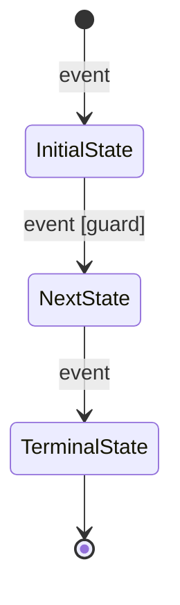
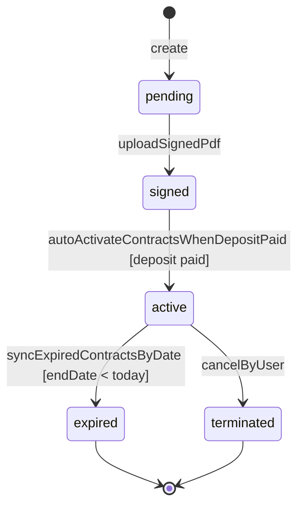

# IntelliServOps State Machine Convention

> Muc dich: Quy uoc ve state machine diagram cho toan bo model co field status trong he thong.
>
> Cap nhat lan cuoi: 2026-04-20

---

## 1. Scope

Convention nay ap dung cho:

- Tat ca model co field ten chinh xac la status trong [prisma/schema.prisma](prisma/schema.prisma).
- Transition chi duoc ve khi co chung cu tu code/API/cron/webhook trong source dang chay.

Khong ap dung cho:

- deliveryStatus
- isActive
- isVerified
- isRead
- Cac logic chi nam trong file backup (\*.bak)

---

## 2. Design Principles

- Evidence-first: moi mui ten transition phai co toi thieu 1 reference code.
- No inference: khong tu suy luan transition neu code chua the hien.
- Enum-complete: tat ca enum value phai duoc ghi nhan trang thai coverage.
- Two-format sync: Mermaid va draw.io phai phan anh 1:1.

---

## 3. Diagram Visual Standard (theo mau)

- Co start pseudo state [*] va end pseudo state [*] khi phu hop.
- Ky hieu start: hinh tron den dac (initial state).
- Node trang thai la hop bo goc (rounded rectangle).
- Ky hieu end: hinh tron dong tam (vong ngoai + cham den ben trong, final state).
- Nhan transition dung dong tu hanh dong ngan gon.
- Label transition co format:
  - event
  - event [guard]
- Su dung mau nhan (xanh) cho label de de scan.

Quy tac huong mui ten:

- Luon huong trai -> phai hoac tren -> duoi neu co the.
- Truong hop rollback thi ve mui ten nguoc va label ro ly do.

---

## 4. Mermaid Standard

Bat buoc dung `stateDiagram-v2`.

Template:

Quy tac ten state trong Mermaid:

- Dung gia tri enum goc (lowercase_with_underscore neu co).
- Khong doi ten thanh nghia dong.

Quy tac label:

- Event uu tien theo endpoint hoac ten service method.
- Guard ngan gon, dat trong []
- Vi du:
  - `uploadSignedPdf`
  - `autoActivateContractsWhenDepositPaid [deposit invoice paid]`

---

## 5. Draw.io Standard

File draw.io phai co:

- 1 trang Cover + Legend.
- Nhieu trang theo domain (Asset, Contract, Request, Operations, Finance, Platform).

Moi trang domain phai co:

- Tieu de domain.
- Legend:
  - Mui ten lien tuc: transition explicit.
  - Mui ten net dut: chua implement/khong observed (chi dung trong khu vuc gap, khong chen vao machine chinh).
- Khoang cach node dong deu.
- Font de nghi: Arial 13.
- Border node: #222222.
- Label transition: #10a44a.
- Initial node: fill #111111.
- Final node: outer ring #111111 + inner dot #111111.

---

## 6. Coverage Annotation Rules

Moi entity phai co bang coverage enum value:

- used-in-transition: da co transition explicit.
- default-only: chi thay o default/create, chua thay transition giua cac state.
- unobserved: enum co trong schema nhung chua thay trong code running path.

Bat buoc co section `Coverage` ngay ben duoi moi diagram.

---

## 7. Evidence Citation Rules

Moi transition trong catalog phai ghi:

- Trigger source (API hoac method).
- Guard condition (neu co).
- File reference co line.

Format reference:

- [src/modules/contracts/contracts.service.ts#L1605](src/modules/contracts/contracts.service.ts#L1605)

Khong duoc ghi line range trong 1 reference.

---

## 8. Unsupported And Gap Handling

Khi enum co value nhung chua thay transition explicit:

- Ghi ro trong section `Gaps`.
- Khong them mui ten vao state machine chinh.
- Co the liet ke o bang phu `Unimplemented transitions`.

---

## 9. Review Checklist

Truoc khi merge tai lieu:

1. Da du 21 model co field status.
2. Moi diagram co start/default state.
3. Moi mui ten co reference code/API.
4. Mermaid va draw.io dong bo so state va so transition.
5. Cac enum value khong bi bo sot (co coverage annotation).

---

## 10. Sample (theo pattern mau)

