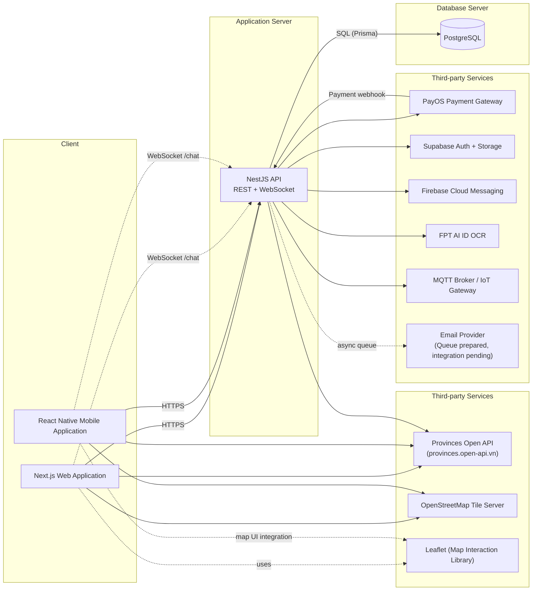

# IntelliServOps - System Architecture Drawing Guide

Version: 1.0
Last updated: 2026-04-21

## 1. Muc tieu tai lieu

Tai lieu nay duoc viet de ban co the ve system architecture giong mau dinh kem, voi:

- Frontend: Next.js Web, React Native Mobile
- Map stack: Leaflet + OpenStreetMap
- City data: https://provinces.open-api.vn/
- Backend: NestJS project hien tai (IntelliServOps)

Tai lieu gom 2 muc do:

- Level 1: Context diagram (giong mau tong quan)
- Level 2: Container/component diagram (chi tiet ben trong App Server)

## 2. Architecture scope

In scope:

- Client apps, API server, database/cache/queue
- Third-party services dang su dung thuc te trong codebase
- Luong map, payment, push notification, IoT, AI verification

Out of scope:

- CI/CD internals
- Monitoring stack chi tiet (Prometheus, Grafana, v.v.)
- Multi-region/high-availability deployment chi tiet

## 3. Level 1 - Context diagram (giong mau)

Copy Mermaid ben duoi de render nhanh hoac dung lam khung ve draw.io:



## 4. Level 2 - App Server internals

Diagram nay de ve ben trong box Application Server:

```mermaid
flowchart TB
  subgraph APP["NestJS Monolith"]
    ENTRY["Entry Layer<br/>Controllers + DTO Validation + Swagger"]
    AUTH["Auth + RBAC<br/>JwtAuthGuard gitrds/interceptors/filters
- Prisma + PostgreSQL (`DATABASE_URL`)
- Redis cache (`cache-manager-redis-yet`) + BullMQ queues
- Payments: PayOS (`@payos/node`) + webhook endpoint
- Push notifications: Firebase Admin SDK (FCM)
- Storage/Auth OTP/OAuth: Supabase
- AI verification CCCD: FPT AI
- IoT realtime control: MQTT + status/telemetry topics
- Realtime chat: Socket.IO namespace `/chat`

Frontend map stack duoc dua vao architecture theo yeu cau:

- Leaflet de tuong tac map
- OpenStreetMap de hien thi map tiles
- Provinces Open API de lay du lieu tinh/huyen/xa

## 6. Protocol matrix (de gan label len mui ten)

| From                   | To                 | Protocol/Pattern      | Muc dich                                  |
| ---------------------- | ------------------ | --------------------- | ----------------------------------------- |
| Next.js / React Native | NestJS API         | HTTPS REST (JSON)     | CRUD nghiep vu                            |
| Next.js / React Native | Chat Gateway       | WebSocket (Socket.IO) | Chat realtime                             |
| NestJS                 | PostgreSQL         | SQL qua Prisma        | Luu tru du lieu chinh                     |
| NestJS                 | Redis              | TCP (Redis protocol)  | Cache, session-like states, queue backend |
| NestJS                 | PayOS              | HTTPS API             | Tao payment link                          |
| PayOS                  | NestJS             | HTTPS Webhook         | Xac nhan ket qua thanh toan               |
| NestJS                 | Supabase           | HTTPS API             | OAuth, OTP SMS, storage                   |
| NestJS                 | Firebase FCM       | HTTPS API             | Day push notification                     |
| NestJS                 | FPT AI             | HTTPS API             | OCR/xac minh CCCD                         |
| NestJS                 | MQTT Broker        | MQTT pub/sub          | Dieu khien va nhan trang thai IoT         |
| Client apps            | OSM Tile Server    | HTTPS tiles           | Render map nen                            |
| Client apps + NestJS   | Provinces Open API | HTTPS API             | Lay metadata dia gioi hanh chinh          |

## 7. Huong dan ve draw.io theo mau dinh kem

Canh bo cuc:

1. Hang tren gom 3 box lon: Client (trai), Application Server (giua), Database Server (phai).
2. Hang duoi gom 2 box "Third-party Services":
   - Box trai: Provinces API, OpenStreetMap, Leaflet.
   - Box phai: PayOS, Supabase, Firebase, FPT AI, MQTT, Email.
3. Mui ten chinh:
   - Client -> Application Server
   - Application Server -> Database
   - Application Server <-> Third-party
   - PayOS -> Application Server (webhook)

Mau sac de nhin giong mau:

- Client: vien xanh nhat
- Application Server: vien do nhat, nen hong nhat
- Database Server: vien vang nhat
- Third-party Services: vien xanh la nhat

Text label goi y:

- "HTTPS" cho REST calls
- "WS" cho chat realtime
- "SQL" cho DB
- "MQTT" cho IoT
- "Webhook" cho callback PayOS

## 8. Luong nghiep vu can uu tien hien thi trong architecture presentation

1. Apartment discovery on map:
   - Next.js/React Native lay danh sach can ho tu API.
   - Leaflet render marker tren nen OpenStreetMap.
   - Provinces API cung cap metadata tinh/huyen/xa cho filter.

2. Payment flow:
   - Client goi API tao PayOS link.
   - User thanh toan tren PayOS.
   - PayOS goi webhook ve backend de cap nhat invoice/payment status.

3. Notification flow:
   - Event trong core modules tao notification.
   - Backend gui push qua Firebase FCM + luu trang thai giao nhan trong DB.

4. IoT flow:
   - User thao tac tren app -> backend.
   - Backend publish MQTT command den board/device.
   - Backend nhan telemetry/status event va luu/phan phoi lai.

## 9. Ghi chu khi trinh bay

- Neu can giong mau 100%, giu nguyen bo cuc 3 box tren + 2 box duoi.
- Neu can ky thuat hon, dung them Level 2 diagram de giai thich ben trong App Server.
- Email provider hien la phan "queue prepared"; co the danh dau dashed/optional node.
```
